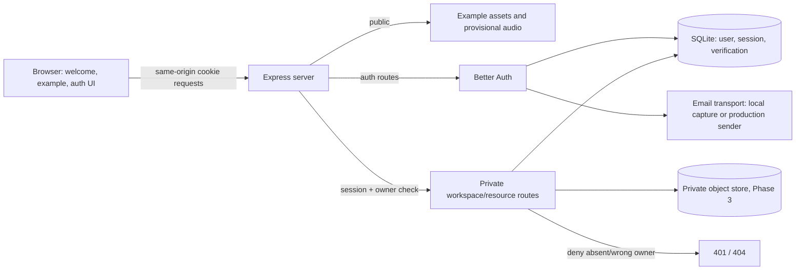

# Phase 2: Private Practice Access - Research

**Researched:** 2026-09-28  
**Domain:** Browser account access, server sessions, owner authorization  
**Confidence:** MEDIUM (official documentation and npm checks; implementation has not been probed)

<user_constraints>
## User Constraints (from CONTEXT.md)

### Locked Decisions

### Guest practice and invitation
- **D-01:** Anyone may complete the verified example practice, including microphone use and live provisional pitch observation, without an account. Visitors may experiment with different sung notes while using that example; observations remain provisional, not grades.
- **D-02:** Offer a small, unobtrusive sign-up invitation near the example and repeat it once after an attempt. Do not interrupt practice with a popup.
- **D-03:** During Phase 2, use the invitation wording: “Create your private space. Your own scores are coming next.” Personal PDF uploads are Phase 3 work.

### Account setup and recovery
- **D-04:** Require email confirmation before a new account can enter its private workspace. While confirmation is pending, show a clear check-your-email state with resend and address-correction options, and let the singer continue using the guest example.
- **D-05:** After confirming email and completing the first sign-in, return the singer to the example practice with a way to reach their workspace. Later sign-ins open the workspace.
- **D-06:** Password recovery uses an email reset flow. After setting a new password, require a fresh sign-in, then return the singer to the private workspace. Revoke existing sessions on every device when the password is reset.

### Signed-in workspace and navigation
- **D-07:** The Phase 2 workspace is a simple personal home with account identity, a link to example practice, and a concise note that personal scores are coming next. Do not put an empty score library or a practice-history message on this home.
- **D-08:** Keep a persistent “My space” link in the header while a signed-in singer uses the example. Show an account icon or label on the main screen rather than prominently displaying the email address. Put Sign out in the account menu.
- **D-09:** Signing out goes to a public welcome page. Give “Try the example” and “Sign in” equal weight there.

### Session behavior
- **D-10:** Keep a singer signed in across browser restarts on the same device for a limited period. Research and planning should choose the exact session lifetimes and enforce expiry server-side.
- **D-11:** If sign-in expires during guest example practice, let the attempt continue uninterrupted. Require sign-in when the singer next tries to open private content.
- **D-12:** If sign-in expires while the private workspace is open, replace private content with a clear session-ended sign-in prompt. After successful sign-in, return to the workspace.

### the agent's Discretion
- The user chose the product behavior above. Exact timeout values, email provider, session implementation, auth storage, and visual styling remain for research and planning within the privacy and security constraints.

### Deferred Ideas (OUT OF SCOPE)
- A separate free pitch playground outside the score-guided example. Its scope and placement belong in a future phase; Phase 2 only preserves pitch exploration within the existing example.
</user_constraints>

<phase_requirements>
## Phase Requirements

| ID | Description | Research Support |
|---|---|---|
| AUTH-01 | A singer can create an account with email and password. | Better Auth email/password with required verification, local capture transport, pending state, resend and corrected signup. [VERIFIED: .planning/REQUIREMENTS.md:10-10; quote: “AUTH-01: A singer can create an account with email and password.”] [CITED: https://better-auth.com/docs/concepts/email] |
| AUTH-02 | A singer can sign in and reset a forgotten password. | Database sessions, fixed expiry, reset tokens, all-session revocation, and protected workspace routes. [VERIFIED: .planning/REQUIREMENTS.md:11-11; quote: “AUTH-02: A singer can sign in and reset a forgotten password.”] [CITED: https://better-auth.com/docs/authentication/email-password] |
</phase_requirements>

## Summary

The Phase 1 app serves a static example page with browser audio and `node:test`; it has no server-authentication boundary. The current package script is `"test": "node --test tests/*.test.cjs"`, and the page loads `practice-fixture.js`, `practice-audio.js`, and `script.js` as browser scripts. [VERIFIED: package.json:5-8; quote: `"test": "node --test tests/*.test.cjs"`] [VERIFIED: index.html:110-112; quote: `<script src="practice-fixture.js"></script>`, `<script src="practice-audio.js"></script>`, `<script src="script.js"></script>`] The phase therefore needs a same-origin application server and persistent auth database. A client-side sign-in flag cannot enforce the roadmap's direct-request or future object-access gate. [CITED: https://cheatsheetseries.owasp.org/cheatsheets/Authorization_Cheat_Sheet.html]

Use Express 5, Better Auth with its SQLite adapter, a small browser auth bundle, and a server-only email transport interface. This preserves the public example and permits fully local verification/reset tests without live email credentials. Add a server-owned account onboarding field and a minimal owner-scoped resource seam before Phase 3 uploads. [CITED: https://better-auth.com/docs/integrations/express] [CITED: https://better-auth.com/docs/adapters/sqlite] [CITED: https://better-auth.com/docs/concepts/database]

**Primary recommendation:** Serve public and private pages from one Node origin; use Better Auth database sessions for identity and check `session.user.id` against the resource owner on **every** private data and object request. Keep the Phase 1 audio loop public. [CITED: https://cheatsheetseries.owasp.org/cheatsheets/Authorization_Cheat_Sheet.html]

## Architectural Responsibility Map

| Capability | Primary Tier | Secondary Tier | Rationale |
|---|---|---|---|
| Guest example, invitation, status/navigation | Browser | API for session status | Browser owns presentation and audio; private status comes from server. [CITED: https://better-auth.com/docs/concepts/session-management] |
| Signup, verification, reset, sign-in | API/backend | Database, email service | Passwords, tokens, session state and transport credentials stay server-side. [CITED: https://better-auth.com/docs/concepts/email] |
| Workspace and resource ownership | API/backend | Database/storage | The server resolves the user and checks resource ownership per request. [CITED: https://cheatsheetseries.owasp.org/cheatsheets/Authorization_Cheat_Sheet.html] |
| PDF object boundary for Phase 3 | API/backend | Private filesystem/object storage | Never expose a storage URL or static directory that bypasses the owner check. [CITED: https://cheatsheetseries.owasp.org/cheatsheets/Authorization_Cheat_Sheet.html] |

## Standard Stack

| Package / facility | Version and registry date | Use | Provenance |
|---|---|---|---|
| `better-auth` **[WARNING: flagged as suspicious for new publish date — human verification before install]** | 1.7.6, published 2026-09-24 | Email/password, verification, reset, sessions, rate limiting | Official installation and Express docs; registry check returned SUS solely `too-new`. [CITED: https://better-auth.com/docs/installation] [CITED: https://better-auth.com/docs/integrations/express] |
| `express` | 5.2.1, registry modified 2026-09-18 | Same-origin HTTP/static and protected API | Official Express 5 routing and Better Auth integration. [VERIFIED: npm registry] [CITED: https://expressjs.com/en/guide/migrating-5/] |
| `better-sqlite3` | 13.0.3, published 2026-08-05 | Persistent local database used by Better Auth and future resource metadata | Recommended SQLite driver in Better Auth docs. [VERIFIED: npm registry] [CITED: https://better-auth.com/docs/adapters/sqlite] |
| `esbuild` (dev dependency) | 0.28.2, published 2026-08-08 | Bundle the vanilla Better Auth browser client; leave existing audio scripts intact | Official browser bundling guide. [VERIFIED: npm registry] [CITED: https://esbuild.github.io/getting-started/] |
| Node built-in `node:test`, `fetch` | Local Node 24.19.0 | Integration tests and server email HTTP transport | Existing test script and runtime probe. [VERIFIED: package.json:5-8; quote: `"test": "node --test tests/*.test.cjs"`] [VERIFIED: local `node --version` probe, 2026-09-28] |

Install exact versions with `npm.cmd install --save-exact better-auth@1.7.6 express@5.2.1 better-sqlite3@13.0.3` and `npm.cmd install --save-exact --save-dev esbuild@0.28.2` after the Better Auth verification checkpoint. On Windows PowerShell here, `npm` resolves to a blocked `.ps1` shim; use `npm.cmd`. [VERIFIED: local command probes, 2026-09-28] The official Better Auth Express integration requires ESM; use `.mjs` for new server/auth modules while preserving the package's existing `"type": "commonjs"` and existing `.cjs` tests. [CITED: https://better-auth.com/docs/integrations/express] [VERIFIED: package.json:12-12; quote: `"type": "commonjs"`]

**Alternatives evaluated:** A managed auth/database/storage service could supply policy enforcement, but local tests would need an emulator or remote service and its owner rules must still be tested. [ASSUMED] Custom password hashing, token lifecycle, and session middleware would duplicate difficult security machinery; choose Better Auth. [CITED: https://cheatsheetseries.owasp.org/cheatsheets/Session_Management_Cheat_Sheet.html] Node built-in SQLite avoids a native dependency but Better Auth currently labels it release candidate and recommends `better-sqlite3`; choose the recommended driver. [CITED: https://better-auth.com/docs/adapters/sqlite]

## Package Legitimacy Audit

The npm legitimacy seam was run against all four names on 2026-09-28. `npm.cmd view` confirmed each current version and publish/modified date. `npm.cmd view ... scripts.postinstall` returned no script for Better Auth, Express, or better-sqlite3; esbuild declares `node install.js`, which is its documented native binary installer. [VERIFIED: npm registry] [CITED: https://esbuild.github.io/getting-started/]

| Package | Age of inspected release | Weekly downloads | Source repo | Verdict | Disposition |
|---|---:|---:|---|---|---|
| `better-auth` | 4 days | 10,347,502 | `github.com/better-auth/better-auth` | SUS: too-new | Check official release provenance and tarball before install; `checkpoint:human-verify`. |
| `express` | 10 months | 156,732,113 | `github.com/expressjs/express` | OK | Approved. |
| `better-sqlite3` | 54 days | 12,528,511 | `github.com/WiseLibs/better-sqlite3` | OK | Approved. |
| `esbuild` | 51 days | 321,785,942 | `github.com/evanw/esbuild` | OK | Approved; inspect native install script when lockfile is generated. |

**Packages removed due to SLOP:** none. **Packages flagged SUS:** `better-auth`. The seam's recency flag is not evidence of compromise; it is a required installation checkpoint. [VERIFIED: npm registry]

## Architecture Patterns



### Recommended Project Structure

Keep the established public example files in place. Add server modules for auth, route guards, email transport, and owner repository; add browser auth/workspace entry modules bundled by esbuild; add SQLite migration/schema scripts and integration tests. These are proposed files, not existing paths. [ASSUMED] The existing example script's microphone and provisional observation behavior should not depend on a successful session-status call. [VERIFIED: .planning/phases/02-private-practice-access/02-CONTEXT.md:17-17; quote: “Anyone may complete the verified example practice, including microphone use and live provisional pitch observation, without an account.”]

### Pattern 1: Same-origin auth handler and server-owned identity

Mount Better Auth's handler before `express.json()`; Express 5 needs a named wildcard. On custom routes, call `auth.api.getSession({ headers: fromNodeHeaders(req.headers) })`, reject missing/unverified identity, and use the returned user ID rather than an ID supplied by the browser. [CITED: https://better-auth.com/docs/integrations/express] [CITED: https://expressjs.com/en/guide/migrating-5/] The private page shell can be served publicly if it contains no private data; its `/api/me/workspace` fetch must be protected, return `Cache-Control: no-store`, and clear the view on 401. [CITED: https://cheatsheetseries.owasp.org/cheatsheets/Authorization_Cheat_Sheet.html]

### Pattern 2: Fixed-duration database session

Configure `session.expiresIn = 7 * 24 * 60 * 60` and `disableSessionRefresh: true` as the Phase 2 product choice: a seven-day, server-checked maximum from sign-in, with a persistent cookie on the same device. Verify the cookie survives browser restart and that the database expiry is enforced; do not infer the policy from cookie expiry alone. [CITED: https://better-auth.com/docs/concepts/session-management] Seven days is an **agent recommendation**, not an externally mandated threshold. [ASSUMED] Disable `session.cookieCache` for this phase so the session table remains the authoritative revocation check on every private request; test this property explicitly. [CITED: https://better-auth.com/docs/concepts/session-management]

### Pattern 3: Account state and route intent

Represent the server-owned `firstSignInCompleted` flag with Better Auth `user.additionalFields` and `input: false`, or an equivalent account-profile table keyed to user ID. Read/update it server-side after the first **verified** successful sign-in, atomically enough that refresh or a second tab cannot repeatedly trigger first-use routing. [CITED: https://better-auth.com/docs/concepts/database] `emailVerified` is Better Auth's stored account field; do not let client input set verification or onboarding status. [CITED: https://better-auth.com/docs/concepts/database] Route intent table: guest → public welcome/example; unverified → check-email/example; first verified sign-in → example with My space; later sign-in → workspace; post-reset fresh sign-in → workspace; expired workspace session → session-ended prompt and then workspace. [VERIFIED: .planning/phases/02-private-practice-access/02-CONTEXT.md:22-34; quote: “After confirming email and completing the first sign-in, return the singer to the example practice”; “Later sign-ins open the workspace”; “After successful sign-in, return to the workspace.”]

### Pattern 4: Email transport and pending correction

Use Better Auth's `sendVerificationEmail` and `sendResetPassword` callbacks, `requireEmailVerification: true`, `sendOnSignUp: true`, `autoSignInAfterVerification: false`, and `autoSignIn: false`. Its documented manual `sendVerificationEmail` supports resend. [CITED: https://better-auth.com/docs/concepts/email] [CITED: https://better-auth.com/docs/reference/options] Provide a **local-only** capture transport injectable into tests; test reads captured links and no real credentials. Production transport uses server-side `RESEND_API_KEY` with Resend's HTTP API and a verified sending domain. [CITED: https://resend.com/docs/api-reference/emails/send-email] [CITED: https://better-auth.com/docs/concepts/email] A pending account cannot use the ordinary `changeEmail` endpoint if verification prevents it from obtaining a session; implement “Correct address” as a new signup attempt with the corrected address, explain that the earlier unverified attempt remains inactive, and define cleanup for stale pending accounts. This is a product/implementation inference to validate with an integration test, not a verified Better Auth guarantee. [ASSUMED]

### Pattern 5: Owner-scoped future resources

Create an owner-bearing metadata seam before uploads: internally, every private resource record has `owner_id`; list uses the authenticated owner; direct get/update/delete use `WHERE id = ? AND owner_id = ?`, with a 404 for absent or foreign IDs. Keep raw objects outside the public static tree and release them only through a route that passes the same check. Seed two users and two inert object records in integration tests, including direct requests under each cookie; Phase 3 reuses this seam for PDF bytes. [CITED: https://cheatsheetseries.owasp.org/cheatsheets/Authorization_Cheat_Sheet.html] Do not expose a user-selectable `owner_id` field on creation. [CITED: https://better-auth.com/docs/concepts/database]

## Don't Hand-Roll

| Problem | Use | Reason |
|---|---|---|
| Password hashing, verification and reset token lifecycle | Better Auth | Security-sensitive token, hashing and enumeration behavior is provided by the auth library and must still be tested. [CITED: https://better-auth.com/docs/reference/security] |
| Session ID generation, cookie policy, revocation | Better Auth database sessions | Cookie-only UI state is not a server authorization boundary. [CITED: https://better-auth.com/docs/concepts/session-management] |
| Email delivery in production | Resend HTTP API from server transport | Keep delivery credentials out of browser assets. [CITED: https://resend.com/docs/api-reference/emails/send-email] |
| Cross-account object access based on opaque IDs | Server owner query | Opaque IDs alone do not grant authorization. [CITED: https://cheatsheetseries.owasp.org/cheatsheets/Authorization_Cheat_Sheet.html] |

## Common Pitfalls

1. **Workspace UI as the gate.** Hiding a link does not protect direct `/api/...` requests. Require a verified session and owner check on each route and byte download; test both accounts' raw HTTP requests. [CITED: https://cheatsheetseries.owasp.org/cheatsheets/Authorization_Cheat_Sheet.html]
2. **Sliding expiry mistaken for a fixed limit.** Better Auth refreshes after `updateAge` by default; set `disableSessionRefresh` and test expiry against the database. [CITED: https://better-auth.com/docs/concepts/session-management]
3. **Incomplete reset revocation.** `revokeSessionsOnPasswordReset` is documented as revoking **other** sessions, so the planner must inspect/test whether the reset request's current session is also gone. If not, explicitly revoke it; require a fresh login after reset in all cases. [CITED: https://better-auth.com/docs/reference/options]
4. **Verification link silently authenticates.** Disable auto sign-in after verification and signup; confirmation leads to sign-in, preserving D-05. [CITED: https://better-auth.com/docs/reference/options]
5. **Email/account enumeration and resend abuse.** Generic signup/reset/resend messages, consistent HTTP response shape, request throttling, and no email addresses in logs. Better Auth production rate limiting exists but is disabled by default in development; explicitly enable it in both and test `429`. Verify its actual protection for resend and reset endpoints rather than assuming the global limit is sufficient. [CITED: https://better-auth.com/docs/concepts/rate-limit] [CITED: https://cheatsheetseries.owasp.org/cheatsheets/Authentication_Cheat_Sheet.html] [CITED: https://cheatsheetseries.owasp.org/cheatsheets/Forgot_Password_Cheat_Sheet.html]
6. **CSRF and session fixation.** Keep one origin, Better Auth origin checks, secure/HttpOnly/SameSite cookie policy, no permissive CORS, and reject cross-origin state changes on custom routes too. Check the session token changes after sign-in and a pre-auth supplied cookie is not adopted. [CITED: https://better-auth.com/docs/reference/security] [CITED: https://cheatsheetseries.owasp.org/cheatsheets/Cross-Site_Request_Forgery_Prevention_Cheat_Sheet.html] [CITED: https://cheatsheetseries.owasp.org/cheatsheets/Session_Management_Cheat_Sheet.html]
7. **Trusting proxy headers.** Behind a reverse proxy, configure the exact trusted proxy/header and restrict direct origin access before basing limits on forwarded IP. [CITED: https://better-auth.com/docs/concepts/rate-limit]
8. **Private cache or stale tab.** Return `Cache-Control: no-store` for private API responses, clear workspace DOM on 401 and sign-out, and retest after revocation in both tabs. [CITED: https://cheatsheetseries.owasp.org/cheatsheets/Session_Management_Cheat_Sheet.html]
9. **Serverless SQLite deployment.** A file database and local private objects require durable storage and a long-running Node host; a static-only host or ephemeral filesystem cannot fulfill these behaviors. Deployment choice remains open until a persistent Node host and email domain are available. [ASSUMED]

**Deployment and secrets:** Set an explicit `BETTER_AUTH_URL` to the HTTPS application origin and a high-entropy `BETTER_AUTH_SECRET` of at least 32 characters in server environment configuration. Keep the SQLite database, private object directory, Resend API key and email transport mode outside the public assets; fail startup in production when any required secret/sender configuration is missing. Use an exact trusted-origin list and configure trusted proxy headers only for a known ingress. [CITED: https://better-auth.com/docs/installation] [CITED: https://better-auth.com/docs/reference/options] [CITED: https://better-auth.com/docs/concepts/rate-limit] The production fail-closed startup rule is an application recommendation. [ASSUMED]

## Code Examples

Illustrative shape from official docs; file names and project-specific values are proposals. Avoid copying without checking the installed version's API. [CITED: https://better-auth.com/docs/integrations/express]

```js
// Source: https://better-auth.com/docs/integrations/express
import express from 'express';
import { toNodeHandler, fromNodeHeaders } from 'better-auth/node';
import { auth } from './auth.mjs';

const app = express();
app.all('/api/auth/*splat', toNodeHandler(auth)); // Express 5
app.use(express.json());
app.get('/api/me/workspace', async (req, res) => {
  const result = await auth.api.getSession({ headers: fromNodeHeaders(req.headers) });
  if (!result?.user?.emailVerified) return res.sendStatus(401);
  res.set('Cache-Control', 'no-store');
  return res.json({ identity: result.user.name });
});
```

For future object reads, parameterize both object ID and authenticated owner ID in one query, then send the byte stream only if a row was returned. This query shape is an application recommendation based on OWASP's per-request ownership rule; the route and column names are proposed, not present in the repo. [CITED: https://cheatsheetseries.owasp.org/cheatsheets/Authorization_Cheat_Sheet.html]

## Project Constraints (from AGENTS.md)

- Browser microphone, score display, and provisional observations must remain usable in a modern browser; one singer and one melodic part; Phase 2 must preserve the example. [VERIFIED: AGENTS.md:11-21; quote: “Browser-based experience”; “One singer and one selected melodic part per session”]
- Scores/history/recordings are private; access control and retention behavior are required; third-party credentials stay server-side. [VERIFIED: AGENTS.md:18-22; quote: “Scores, practice history, and optional recordings are user-private”; “Third-party service credentials must remain server-side”]
- Preserve existing plain JavaScript conventions where touching the example: two-space indentation, single quotes, semicolons, camelCase, browser behavior in `script.js`, markup/styles in `index.html`, concise UI error text and scoped failure logging. [VERIFIED: AGENTS.md:87-107; quote: “Keep browser behavior in `script.js` and markup/styles in `index.html`”; “Do not log microphone data, API keys, or complete pitch sessions”]
- Use a GSD workflow for edits; this research file is produced under the orchestrated plan-phase research task. [VERIFIED: AGENTS.md:241-249; quote: “Before using Edit, Write, or other file-changing tools, start work through a GSD command”]

## State of the Art

| Earlier/current approach in this repo | Recommended Phase 2 approach | Impact |
|---|---|---|
| Static files with browser-only state and a prototype client API-key pattern. [VERIFIED: AGENTS.md:45-45; quote: “No application framework - static HTML page and vanilla JavaScript”] [VERIFIED: AGENTS.md:21-21; quote: “the existing client-side API-key pattern cannot be retained”] | Same-origin Node server, database-backed auth sessions, server-only service credentials. [CITED: https://better-auth.com/docs/integrations/express] | Private content and later PDF bytes gain a server-enforced request boundary. [CITED: https://cheatsheetseries.owasp.org/cheatsheets/Authorization_Cheat_Sheet.html] |
| Existing Node built-in tests focus on the example and audio. [VERIFIED: package.json:7-7; quote: `"test": "node --test tests/*.test.cjs"`] | Add HTTP tests with two isolated accounts, captured email, time expiry and direct object requests. [ASSUMED] | Tests the Phase 2 roadmap gate before uploads exist. [VERIFIED: .planning/ROADMAP.md:62-62; quote: “Exercise account creation, recovery, session expiry, and two-account authorization checks, including direct resource requests.”] |

## Assumptions Log

| # | Claim / decision | Risk if wrong |
|---|---|---|
| A1 | Seven-day fixed session duration is the desired product balance. | Users may want a shorter or longer period; planner should make the policy explicit. |
| A2 | Address correction can restart signup rather than mutate an unverified identity. | May leave stale pending rows and surprise users who reuse the wrong address; test copy and cleanup. |
| A3 | A persistent Node host with durable SQLite and private object storage is acceptable for deployment. | Hosting architecture would need a Postgres/object-store substitution. |
| A4 | Resend is an acceptable production transactional email provider. | Another provider may be preferred; transport boundary keeps change localized. |

## Open Questions

1. **Production host and sending domain:** The current repository supplies neither. Implement and test locally now; before public release, provision durable server/database/object storage, HTTPS, an email sender domain, and server-side secrets. [ASSUMED]
2. **Reset revocation semantics in 1.7.6:** Documentation says “all other sessions”; integration tests must prove **every** previously issued cookie, including the browser initiating reset if it was signed in, fails immediately after reset. [CITED: https://better-auth.com/docs/reference/options]
3. **Stale pending account cleanup:** Choose a retention interval as part of the plan and document it as a product policy; no fixed interval is specified upstream. [ASSUMED]

## Environment Availability

| Dependency | Required by | Available | Version / condition | Fallback |
|---|---|---|---|---|
| Node | Server, build, tests | Yes | 24.19.0 (local probe) | None needed. |
| npm | Package install | Yes via `npm.cmd` | 11.17.0 (local probe) | Use `.cmd` from PowerShell. |
| SQLite driver | Local persistence | Not installed | Install planned package | Node built-in SQLite is a documented release candidate, but would require a deliberate adapter change. [CITED: https://better-auth.com/docs/adapters/sqlite] |
| Docker | None | Not detected | No local container dependency planned | — |
| Live email credentials/domain | Production email | Not available in repo | Use injectable local capture for tests | Production release gate. |
| Modern browser/HTTPS | Mic and persistent-cookie acceptance | Browser not probed here | Manual browser gate | localhost for local practice; HTTPS in deployment. [VERIFIED: AGENTS.md:66-66; quote: “HTTPS is required by browsers for microphone access outside localhost”] |

## Validation Architecture

| Property | Value |
|---|---|
| Framework | Existing Node `node:test`; use HTTP integration tests against an ephemeral local server and isolated temporary SQLite files. [VERIFIED: package.json:5-8; quote: `"test": "node --test tests/*.test.cjs"`] |
| Quick run | `node --test tests/auth-flow.test.cjs tests/ownership.test.cjs` (proposed Wave 0 files). |
| Full run | `npm.cmd test` plus browser acceptance and package build. |

| Requirement / gate | Automated proof | Browser/manual proof |
|---|---|---|
| AUTH-01 | Signup → no session/private access → captured verification link → verified state → first sign-in → example; duplicate email returns generic response; resend works; corrected-address signup works. | Check pending/error copy, keyboard flow, guest example with mic and invitation shown only in specified places. |
| AUTH-02 | Later sign-in → workspace; sign-out invalidates cookie; wrong password generic; reset token single-use/expiry; reset forces fresh sign-in; all pre-reset cookies revoked; post-reset sign-in → workspace. | Restart browser and confirm bounded persistence; reset email link UI. |
| Session expiry | Set short test expiry or clock injection; private API returns 401 at expiry, workspace replaces contents, then sign-in returns workspace; example attempt remains running across expiry. | Real browser attempt continues when session expires. |
| Two-account authorization | Alice/Bob sessions; Alice resource ID requested with Bob cookie yields 404 for metadata and bytes; list never shows Alice row; unauthenticated direct request yields 401; forged owner/body/URL cannot override session ID. | Two browser profiles and direct HTTP requests. |
| CSRF/fixation/abuse | Cross-origin POST rejected; pre-auth session token not reused; rate-limited sign-in/reset/resend returns 429; generic account-existence response status/body; no private cache. | Inspect cookie flags and network response in deployed HTTPS environment. |

**Wave 0:** Add server factory with isolated database and injected email transport; create auth-flow, ownership, and security integration test files; add a build script for auth client bundle. Preserve existing `npm.cmd test` fixture/audio tests. [ASSUMED] **Phase exit gate:** run full suite, complete two-account direct-resource and browser-expiry exercises, then verify production environment variables and durable storage before exposing real user accounts. [VERIFIED: .planning/ROADMAP.md:56-62; quote: “Exercise account creation, recovery, session expiry, and two-account authorization checks, including direct resource requests.”]

## Security Domain

ASVS 5.0 Level 1 categories map as follows; the current chapter labels are V6 Authentication, V7 Session Management, V8 Authorization, plus V2 Validation/Sanitization/Encoding, V3 Web Frontend Security, V4 API/Web Service, and V11 Cryptography. [CITED: https://github.com/OWASP/ASVS/blob/master/5.0/docs_en/OWASP_Application_Security_Verification_Standard_5.0.0_en.flat.json]

| ASVS category | Applies | Phase control |
|---|---|---|
| V6 Authentication | Yes | Library-backed password verification, email confirmation, generic failures, throttling, single-use reset. [CITED: https://cheatsheetseries.owasp.org/cheatsheets/Authentication_Cheat_Sheet.html] |
| V7 Session Management | Yes | Database token lookup, fixed expiry, sign-out/reset revocation, HttpOnly/Secure/SameSite cookie, session fixation test. [CITED: https://cheatsheetseries.owasp.org/cheatsheets/Session_Management_Cheat_Sheet.html] |
| V8 Authorization | Yes | Deny by default; checked owner per private request and object byte access. [CITED: https://cheatsheetseries.owasp.org/cheatsheets/Authorization_Cheat_Sheet.html] |
| V2/V3/V4 Input, frontend, API | Yes | Validate auth input; render identity with text nodes; reject cross-site mutations and untrusted origins. [CITED: https://cheatsheetseries.owasp.org/cheatsheets/Cross-Site_Request_Forgery_Prevention_Cheat_Sheet.html] |
| V11 Cryptography | Yes | Auth library/password primitives and high-entropy server secret; no custom crypto. [CITED: https://better-auth.com/docs/installation] |

**Threats:** credential stuffing (Spoofing) → rate limits and generic failure; IDOR (Information disclosure) → owner predicate on direct resource requests; CSRF (Tampering) → origin/Fetch Metadata and same-origin custom API policy; session theft/fixation (Spoofing) → secure cookie and renewal checks; reset-token replay (Elevation of privilege) → expiry and one-use tests. [CITED: https://cheatsheetseries.owasp.org/cheatsheets/Authentication_Cheat_Sheet.html] [CITED: https://cheatsheetseries.owasp.org/cheatsheets/Authorization_Cheat_Sheet.html] [CITED: https://cheatsheetseries.owasp.org/cheatsheets/Forgot_Password_Cheat_Sheet.html]

## Sources

**Official vendor:** https://better-auth.com/docs/installation ; https://better-auth.com/docs/integrations/express ; https://better-auth.com/docs/adapters/sqlite ; https://better-auth.com/docs/concepts/email ; https://better-auth.com/docs/authentication/email-password ; https://better-auth.com/docs/concepts/session-management ; https://better-auth.com/docs/concepts/rate-limit ; https://better-auth.com/docs/reference/security ; https://better-auth.com/docs/reference/options ; https://esbuild.github.io/getting-started/ ; https://expressjs.com/en/guide/migrating-5/ ; https://resend.com/docs/api-reference/emails/send-email .

**Official security:** https://cheatsheetseries.owasp.org/cheatsheets/Authorization_Cheat_Sheet.html ; https://cheatsheetseries.owasp.org/cheatsheets/Authentication_Cheat_Sheet.html ; https://cheatsheetseries.owasp.org/cheatsheets/Forgot_Password_Cheat_Sheet.html ; https://cheatsheetseries.owasp.org/cheatsheets/Session_Management_Cheat_Sheet.html ; https://cheatsheetseries.owasp.org/cheatsheets/Cross-Site_Request_Forgery_Prevention_Cheat_Sheet.html ; https://github.com/OWASP/ASVS/blob/master/5.0/docs_en/OWASP_Application_Security_Verification_Standard_5.0.0_en.flat.json .

**Registry and local probes:** `npm.cmd view` for four package versions, publish times, scripts and engines; `gsd-tools query package-legitimacy check --ecosystem npm` for four packages; `node --version`, `npm.cmd --version`; repo source files opened this session. Research-cache writes failed due `EPERM` outside the workspace; this did not prevent source verification. [VERIFIED: local tool outputs, 2026-09-28]

## Metadata

- Standard stack: **MEDIUM** — official docs and registry metadata; Better Auth requires a recency checkpoint.
- Architecture: **MEDIUM** — official vendor patterns and OWASP; no code implementation probe yet.
- Pitfalls: **MEDIUM** — official OWASP and vendor docs; reset all-session semantics require an integration falsification test.
- Valid until: **2026-10-05** for package versions and auth API behavior; recheck before install.
